# 💸 Tobi Tracker


A modern expense tracking application built with React Native, Expo Router, TypeScript, and Firebase.

Tobi Tracker is designed to help users manage transactions, monitor spending habits, and stay financially organized through a clean and intuitive user experience.

---

## ✨ Features

- 🔐 Secure Firebase Authentication
- 📧 Email Verification
- 🔑 Forgot Password Support
- 💰 Add & Manage Expenses
- 📊 Spending Statistics & Insights
- 💳 Wallet Management
- 👤 User Profile Management
- ☁️ Cloud Firestore Database
- 📱 Android & iOS Support
- 🎨 Clean & Responsive UI

---

## 📱 Download APK

Download the latest Android APK from the **Releases** section of this repository.

> Android users can install Tobi Tracker directly using the APK provided in Releases.

---

## 📸 Screenshots

| Home | Welcome |
|----------|----------|
|  | 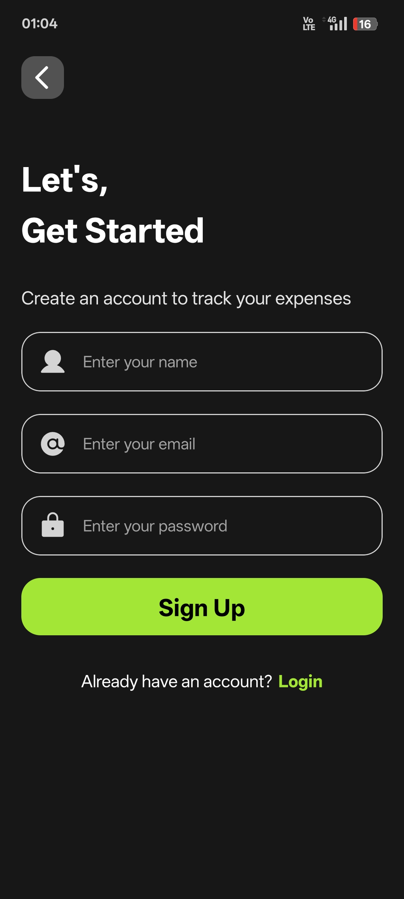 |

| Login | Profile |
|----------|----------|
| 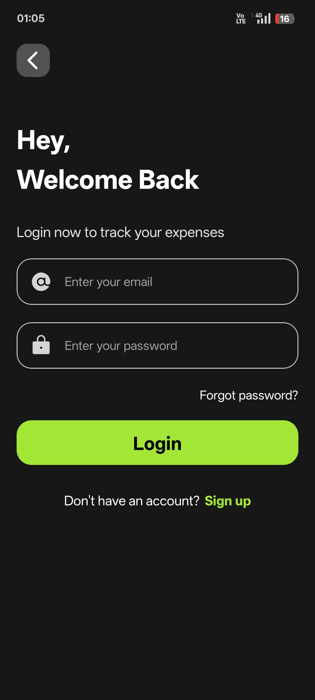 | 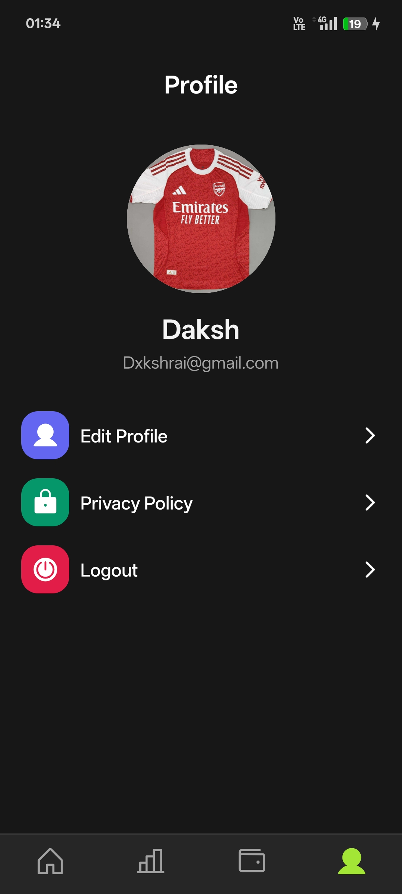 |

| Transaction | New Transaction |
|----------|----------|
| 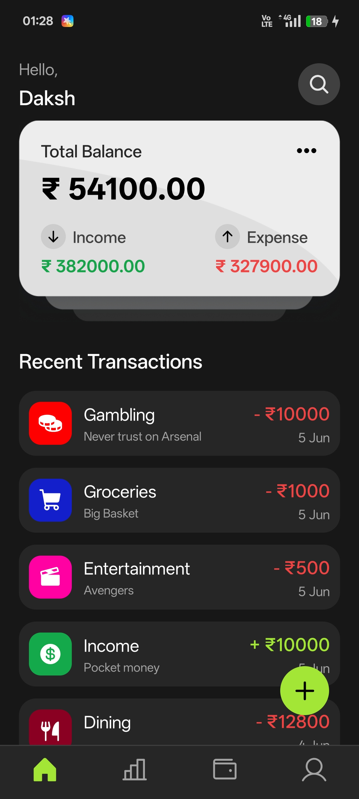 | 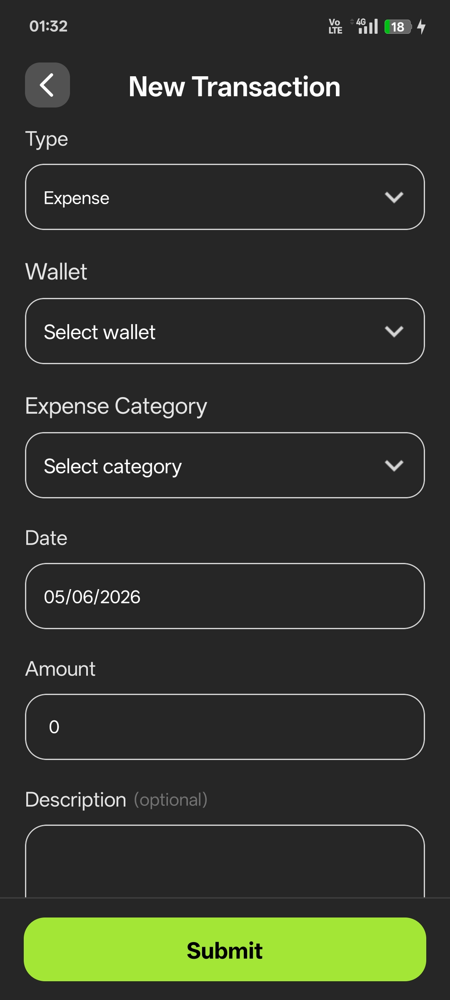 |

| Statistics | Wallet |
|----------|----------|
| 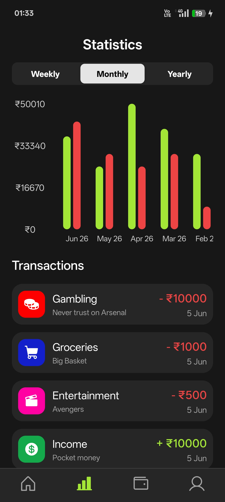 | 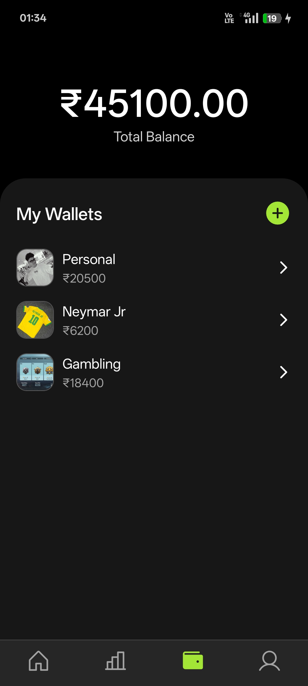 |

| New Wallet | Update Wallet |
|----------|----------|
| 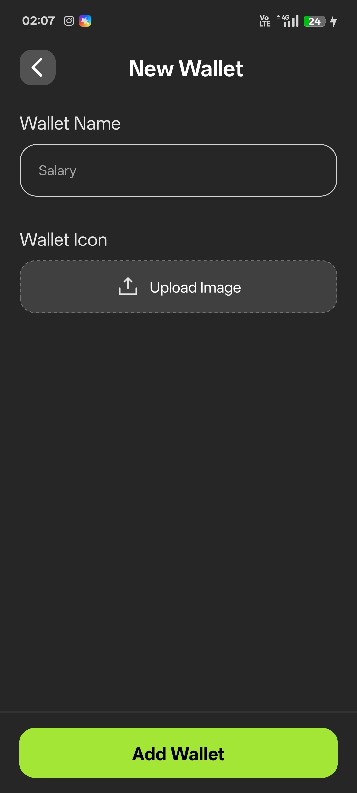 | 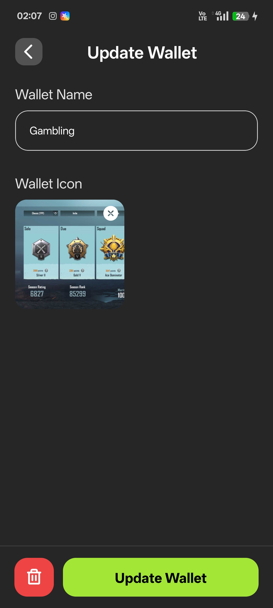 |

| Search | Privacy Policy |
|----------|----------|
| 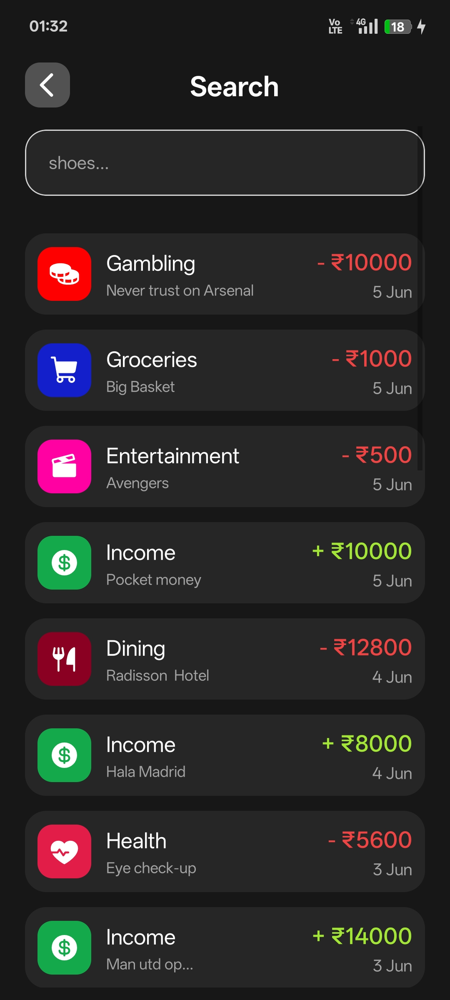 | 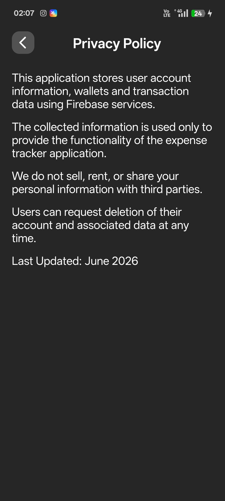 |

---

## 🛠 Tech Stack

### Frontend
- React Native
- Expo
- Expo Router
- TypeScript

### Backend & Database
- Firebase Authentication
- Cloud Firestore

### Libraries
- React Native Reanimated
- Expo Image Picker
- React Native Gifted Charts
- React Navigation

---

## 🚀 Installation

Clone the repository:

```bash
git clone https://github.com/dxkshrai/expense-tracker-app.git
```

```bash
cd expense-tracker-app
```

```bash
npm install
```

```bash
npx expo start
```

---

## 📦 Build APK

```bash
eas build --platform android --profile preview
```

---

## 🎯 Future Improvements

- Budget Planning
- Expense Categories Analytics
- Recurring Transactions
- Monthly Reports
- Dark Mode
- Cloud Backup Enhancements

---

## 👨‍💻 Developer

Daksh Rai

Built with ❤️ using React Native, Expo, and Firebase.

---

### ⭐ If you found this project interesting, consider starring the repository.


